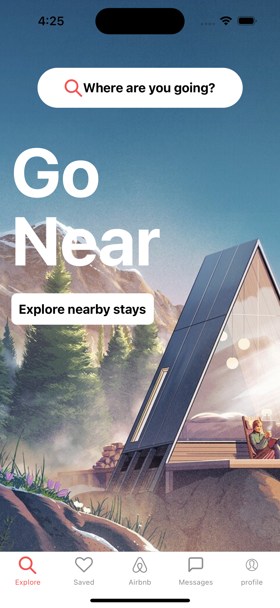
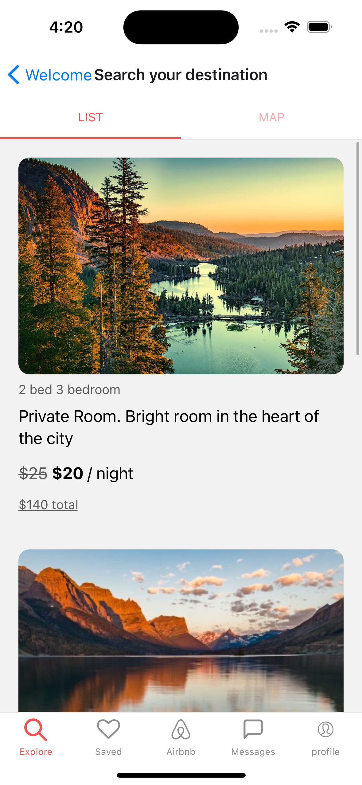
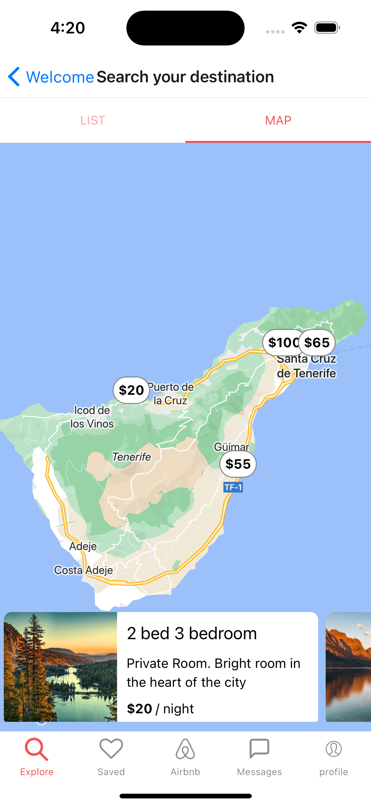

# Clone of airbnb

## step

1. create a new application by
   `npx create-expo-app airbnb-clone`

2. add the web support `npx expo install react-dom react-native-web @expo/webpack-config`

3. run `npx expo start`

4. add tailwind class name library `yarn add twrnc`

5. add tailwind config file for autocomplete add style to the class name in tailwind autocomplete `npx tailwindcss init`
6. add React Navigation both native and stack `yarn add @react-navigation/native @react-navigation/stack @react-navigation/bottom-tabs`

7. add expo react navigation decencies by `npx expo install react-native-screens react-native-safe-area-context`

8. add gesture handle by `npx expo install react-native-gesture-handler`

9. add `npm install @react-navigation/material-top-tabs react-native-tab-view`

10. add `npx expo install react-native-pager-view`

11. add `yarn add react-native-google-places-autocomplete`

12. create .env file and save the key there

13. add react native dotenv to project `yarn add react-native-dotenv`

14. go to babel.config.js add

```
    plugins: [ [ "module:react-native-dotenv", { moduleName: "@env", path: ".env", }, ], ],

```

15. add React native map to the project `yarn add react-native-maps`

16. add amplify
    `npm install aws-amplify amazon-cognito-identity-js @react-native-community/netinfo @react-native-async-storage/async-storage core-js`

17 init the amplify
`amplify init`

# preview

| Home                         | List                         | Map                          |
| ---------------------------- | ---------------------------- | ---------------------------- |
|  |  |  |
|  |
