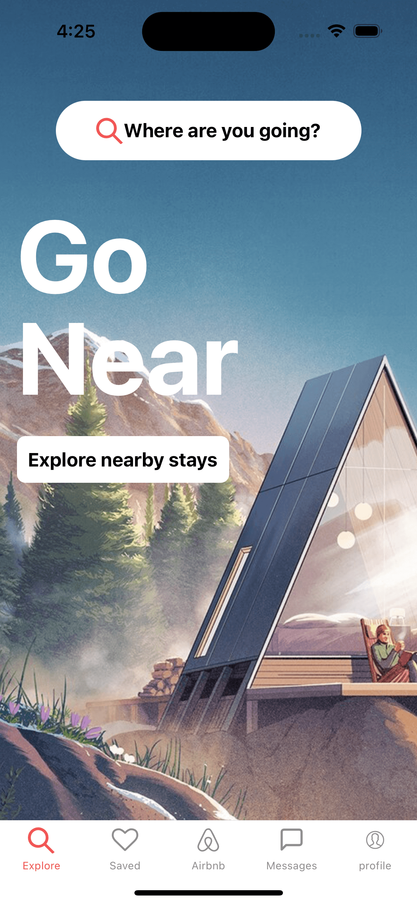
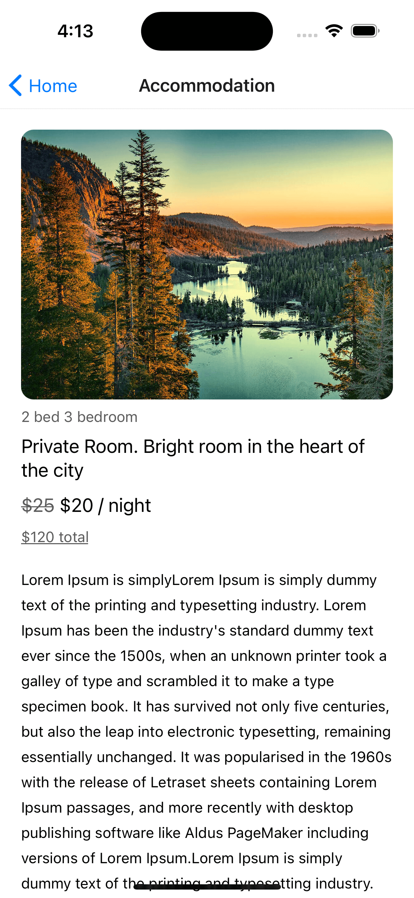

# Clone of airbnb

## step

1. create a new application by
   `npx create-expo-app airbnb-clone`

2. add the web support `npx expo install react-dom react-native-web @expo/webpack-config`

3. run `npx expo start`

4. add tailwind class name library `yarn add twrnc`

5. add tailwind config file for autocomplete add style to the class name in tailwind autocomplete `npx tailwindcss init`
6. add React Navigation both native and stack `yarn add @react-navigation/native @react-navigation/stack @react-navigation/bottom-tabs`

7. add expo react navigation decencies by `npx expo install react-native-screens react-native-safe-area-context`

8. add gesture handle by `npx expo install react-native-gesture-handler`

9. add `npm install @react-navigation/material-top-tabs react-native-tab-view`

10. add `npx expo install react-native-pager-view`

11. add `yarn add react-native-google-places-autocomplete`

12. create .env file and save the key there

13. add react native dotenv to project `yarn add react-native-dotenv`

14. go to babel.config.js add

```
    plugins: [ [ "module:react-native-dotenv", { moduleName: "@env", path: ".env", }, ], ],

```

15. add React native map to the project `yarn add react-native-maps`

16. add amplify
    `npm install aws-amplify amazon-cognito-identity-js @react-native-community/netinfo @react-native-async-storage/async-storage core-js`

17. init the amplify
    `amplify init`

18. add amplify auth
    `amplify add auth`
    . select Default configuration.
    . select username as the default auth
    . yes i am done
    . then `amplify push`

19. add to app.js

```
import { Amplify, Auth } from 'aws-amplify';
import awsconfig from './aws-exports';
Amplify.configure(awsconfig);
```

20. add aws-amplify-ui
    `yarn add @aws-amplify/ui-react-native aws-amplify react-native-safe-area-context amazon-cognito-identity-js @react-native-community/netinfo @react-native-async-storage/async-storage react-native-get-random-values react-native-url-polyfill`

21. add api with amplify with
    `amplify add api`
    . we use graphQl
    . then select provide api name : airbnbclone
    . then select authorization type for api as api key.
    . description for api could be anything
    . days for api key to expire : 365
    . configure more auth type :n
    . select single object with fields
    . do you want to edit scheme : n

22. go to amplify folder then select api then schema.graphql add the schema
    `amplify push` that will create dynamo db
    . do you want to generate code: yes
    . chose the code generation :javascript
    . want to generate queries and other :yes
    . maximum statement depth :2

23. we can see our resources in cloud we can use
    `amplify console`

# preview

| Home                         | List                         | Map                          |
| ---------------------------- | ---------------------------- | ---------------------------- |
|  |  |  |
|  |
